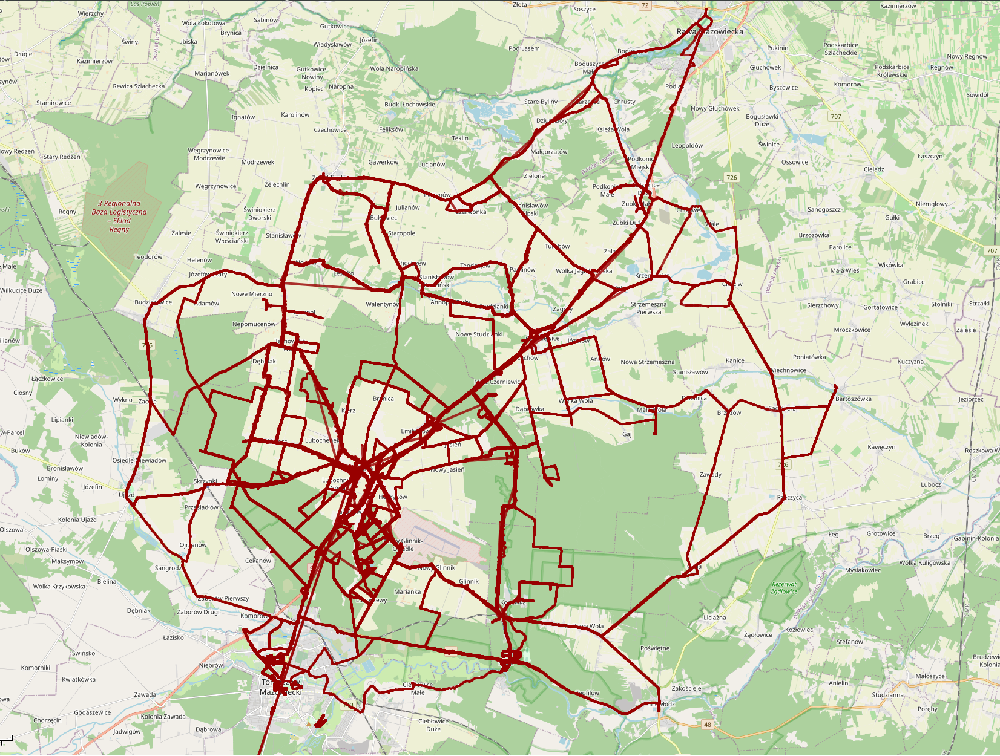

# Scripts that merges multiple GPX/TCX files into one

## TCX fixer
Removes blank characters from the begining and the end of the TCX file.
Reads files from folder tcx/ and saves fixed files in tcx/fixed/.
```shell
php fix_tcxes.php
```


## TCX to GPX
Converts TCX files to GPX.
Reads files from folder tcx/fixed and saves converted files in gpx with prefix converted_from_tcx_
```shell
php tcx_to_gpx.php
```

## Merge
Merges all GPX files from folder gpx/ into one file out/merged.gpx
```shell
php merge.php
```

## Example result


